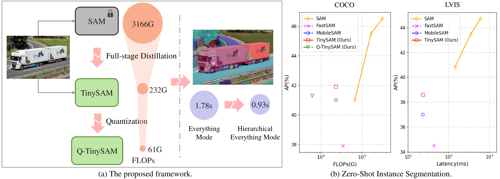
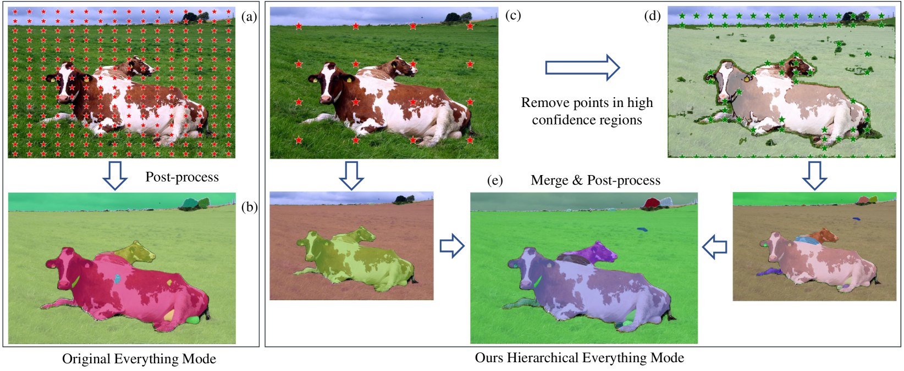
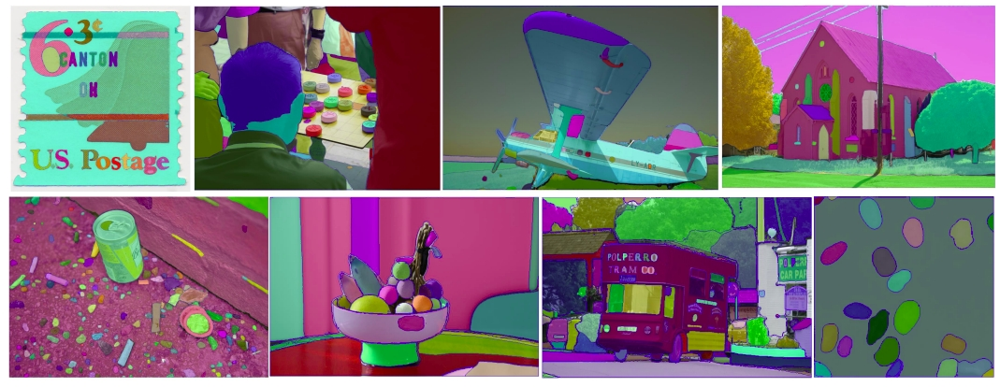

# TinySAM
**TinySAM: Pushing the Envelope for Efficient Segment Anything Model**

*Han Shu, Wenshuo Li, Yehui Tang, Yiman Zhang, Yihao Chen, Houqiang Li, Yunhe Wang, Xinghao Chen*

[[`Paper`](https://arxiv.org/abs/2312.13789)] [[`BibTeX`](#citation)]


## Updates

* **2023/12/22**: Pre-trained models and codes of TinySAM are released both in [Pytorch](https://github.com/xinghaochen/TinySAM) and [Mindspore](https://gitee.com/mindspore/models/tree/master/research/cv/TinySAM).

## Overview

We propose a framework to obtain a tiny segment anything model (**TinySAM**) while maintaining the strong zero-shot performance. We first propose a full-stage knowledge distillation method with online hard prompt sampling strategy to distill a lightweight student model. We also adapt the post-training quantization to the promptable segmentation task and further reducing the computational cost. Moreover, a hierarchical segmenting everything strategy is proposed to accelerate the everything inference by with almost no performance degradation. With all these proposed methods, our TinySAM leads to orders of magnitude computational reduction and pushes the envelope for efficient segment anything task. Extensive experiments on various zero-shot transfer tasks demonstrate the significantly advantageous performance of our TinySAM against counterpart methods.


<div align=center>
<sup>Figure 1: Overall framework and zero-shot results of TinySAM.</sup>
</div>


<div align=center>
<sup>Figure 2: Our hierarchical strategy for everything mode.</sup>
</div>


<div align=center>
<sup>Figure 3: Visualization results of TinySAM.</sup>
</div>

## Requirements
The code requires `python>=3.7` and we use `torch==1.10.2` and `torchvision==0.11.3`. To visualize the results, `matplotlib>=3.5.1` is also required.  
- python 3.7
- pytorch == 1.10.2
- torchvision == 0.11.3
- matplotlib==3.5.1

## Usage

1. Download [checkpoints](#evaluation) into the directory of *weights*.

2. Run the demo code for single prompt of point or box.

```
python demo.py
```
3. Run the demo code for hierarchical segment everything strategy.
```
python demo_hierachical_everything.py
```

## Evaluation
We follow the setting of original [SAM](https://arxiv.org/abs/2304.02643) paper and evaluate the zero-shot instance segmentaion on COCO and LVIS dataset. The experiment results are described as followed.

| Model               | FLOPs (G) |COCO AP (%) | LVIS AP (%)| 
| ------------------- | -------- | ------- |------- |
| SAM-H                 |3166| 46.5     | 44.7       | 
| SAM-L                 |1681| 45.5     | 43.5       | 
| SAM-B                 |677| 41.0     | 40.8       | 
| FastSAM                 |344| 37.9     | 34.5       | 
| MobileSAM            | 232|41.0     | 37.0       | 
| **TinySAM**  [\[ckpt\]](https://github.com/xinghaochen/TinySAM/releases/download/1.0/tinysam.pth)       | 232|41.9     | 38.6       | 
| **Q-TinySAM**            | 61|41.3     | 37.7       | 


## Acknowledgements
We thank the following projects: [SAM](https://github.com/facebookresearch/segment-anything), [MobileSAM](https://github.com/ChaoningZhang/MobileSAM), [TinyViT](https://github.com/microsoft/Cream).

## Citation
```bibtex
@article{tinysam,
  title={TinySAM: Pushing the Envelope for Efficient Segment Anything Model},
  author={Shu, Han and Li, Wenshuo and Tang, Yehui and Zhang, Yiman and Chen, Yihao and Wang, Yunhe and Chen, Xinghao},
  journal={arXiv preprint arXiv:2312.13789},
  year={2023}
}
```

## License

This project is licensed under <a rel="license" href="License.txt"> Apache License 2.0</a>. Redistribution and use should follow this license.
